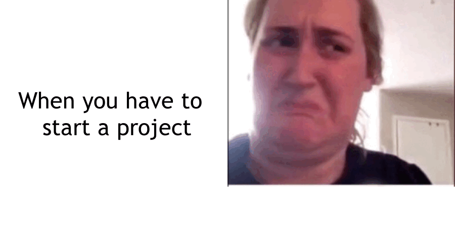

```{r setup, include=FALSE}
knitr::opts_chunk$set(echo=TRUE, message=FALSE, warning=FALSE, error=FALSE)
library(magick)
```

```{css}
body {
  background-image: linear-gradient(to bottom, #def7ba, #f5ddae);
  background-size: 100% 200%;
  transition: background-position 0.5s;
}

body:hover {
  background-position: 0 100%;
}

a {
  color: red;
  
}

a:hover {
  color: green;
}
```

## Project requirements
For this project, I used my existing Github account(please follow I might make something cool hopefully) and I created a stats220 repo as well. The repo includes a readme file with the two different headers, two sets of bullet points of different types and also has a link to my linkedin profile(connect with me). Below, I have included a breakdown of my project 1 folder files which includes the rproject file, and the second screenshot shows the images I had in my images folder, which were used in the making of the meme and the gif, along with these attached screenshots.

[Github](https://github.com/femt28/stats220)


## My meme

```{r meme-code, eval=TRUE}
first_text <- image_blank(width = 450, height = 450, color = "#FFFFFF") %>% 
  image_annotate(text = "When you have to \n start a project", color = "#000000", size = 45, font = "Trebuchet", gravity = "center")

second_text <- image_blank(width = 450, height = 450, color = "#FFFFFF") %>% 
  image_annotate(text = "It's to make a meme", color = "#000000", size = 45, font = "Impact", gravity = "center")


#Static meme vectors and meme itself

top_image <- image_read("images\\top_image.png") %>%
  image_scale(450)

bottom_image <- image_read("images\\bottom_image.png") %>%
  image_scale(450)

top_vector <- c(first_text, top_image)%>%
  image_append()
bottom_vector <- c(second_text, bottom_image)%>%
  image_append()

meme <- c(top_vector, bottom_vector)%>%
  image_append(stack = TRUE)
meme
```


```{r animation-code, eval=FALSE}
third_text <- image_blank(width = 450, height = 450, color = "#FFFFFF") %>% 
  image_annotate(text = "It's due on Wednesday", color = "#000000", size = 45, font = "Impact", gravity = "center")

fourth_text <- image_blank(width = 450, height = 450, color = "#FFFFFF") %>% 
  image_annotate(text = "It's Monday", color = "#000000", size = 45, font = "Impact", gravity = "center")

fifth_text <- image_blank(width = 450, height = 450, color = "#FFFFFF") %>% 
  image_annotate(text = "I did it pls give me an A", color = "#000000", size = 45, font = "Impact", gravity = "center")

#gif vectors and gif

third_image <- image_read("images\\animation_3.png") %>%
  image_scale(450)
third_vector <- c(third_text, third_image)%>%
  image_append()
fourth_image <- image_read("images\\animation_4.png") %>%
  image_scale(450)
fourth_vector <- c(fourth_text, fourth_image)%>%
  image_append()
fifth_image <- image_read("images\\animation_5.png") %>%
  image_scale(450)
fifth_vector <- c(fifth_text, fifth_image)%>%
  image_append()


frames <- c(top_vector, bottom_vector, third_vector, fourth_vector, fifth_vector)
gif <- image_animate(frames, fps=1) %>%
  

```


## Creativity

For this project, I extended the meme to my personal context so I could hopefully get extra marks for my work. I also added extra css to the such that the background will transition as the page scrolls, and I also changed the colour of the hyperlink, and changed the hover colour of the hyperlink(can be seen when hovering over the github link I added above). 

## Learning reflection

One important idea I learnt from this project is the approach to making web content using Rmarkdown and R. On top of those 2, I had to revise my CSS knowledge to change the appearance of the html page. I am definitely more curious as to how to combine R with other languages such as Python to further increase the data manipulation abilities and combine it with other packages such as Pandas and NumPy in Python. Of course, using AI and machine learning to further increase the abilities of this approach will be extremely interesting to learn. And how to webscrape, since if R can be used to create a web document, there should be some way to reverse this process to gather information from existing html pages.
