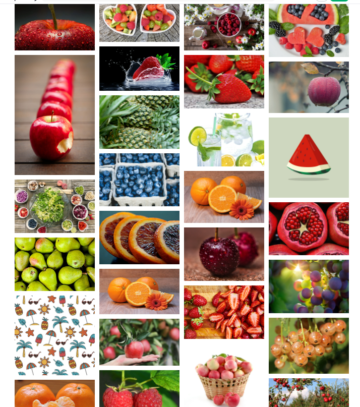
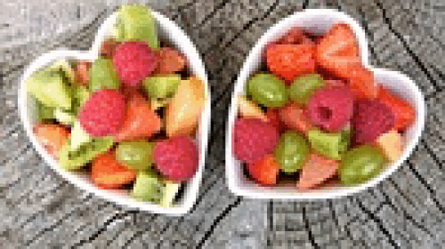

```{r setup, include=FALSE}
knitr::opts_chunk$set(echo=TRUE, message=FALSE, warning=FALSE, error=FALSE)
library(tidyverse)
library(jsonlite)
library(magick)
```

```{css}
body {
  background-image: linear-gradient(to bottom, #e87c74, #e8bc74);
  background-size: 100% 200%;
  transition: background-position 0.5s;
}

body:hover {
  background-position: 0 100%;
}

a {
  color: #e874c9;
  
}

a:hover {
  color: green;
}
```

## Introduction

```{r}
json_data <- fromJSON("pixabay_data.json")
pixabay_photo_data <- json_data$hits

# Selecting only some variables from pixabay_photo_data
selected_photos <- pixabay_photo_data %>%
  select(previewURL, pageURL, tags, likes, comments, downloads, user)
```

For my search on pixabay, I used the words "Fresh fruit". This idea came to me as I was eating a cookie and was thinking I should really get back into exercising as I have really slacked off this year so far, especially since I come from a very active background. Thus, I decided this stats project will be the start of healthy snacking which leads to healthier lifestyle including exercising, and fresh fruit is a healthy snack. 

The first few rows of the search returned the following images: 

Firstly, I saw that majority of the images were in landscape orientation. Secondly, I noticed a lot fo red and oranges from the apples, strawberries and oranges that were in the first few images returned by the search. Thirdly, the tags in the image usually included the fruit in the image i.e if the images had an apple, one of the tags was "apple".

```{r}
selected_photos %>%
  select(pageURL) %>%
  knitr::kable()
```
I also created an animated gif:




## Key features of selected photos
```{r}
selected_photos <- selected_photos %>%
  mutate(
    num_likes = ifelse(likes < 500, "low",
                      ifelse(likes < 1000, "medium",
                             ifelse(likes < 1500, "high", "very high"))),
    ratio = comments / likes,
    user_length = nchar(user)
  )

# Filtering to select only around 50 photos
selected_photos <- selected_photos %>%
  filter(downloads > 100000)
```

```{r}
mean_likes <- selected_photos$likes %>% mean(na.rm = TRUE)
mean_ratio <- selected_photos$ratio %>% mean(na.rm = TRUE)
total_downloads <- selected_photos$downloads %>% sum(na.rm = TRUE)
```


The total number of photos I have is `r nrow(selected_photos)`.

There mean number of likes is `r mean_likes`.

The average ratio of comments to likes is `r mean_ratio`.

There were `r total_downloads` downloads in total for my selected photos.

I also made a graph:

```{r}
plot1 <- ggplot(data = selected_photos) + 
  geom_point(aes(x=comments, y=num_likes)) + 
  labs(title="More likes = more comments?",
       subtitle="Comparing the likes to comments",
       x="Number of comments",
       y="Number of likes")
plot1
```

## Creativity

I made a cool graph to show the relation between the number of likes(sorted into 4 categories) and number of comments on the photo. I also added my cool css and made it change from red to orange to match the common colours I identified initially in the first few rows.

## Learning reflection

One important idea I learnt from Module 3: Creating new variables and data tables was inline code writing. I feel this is important as with this, I can now seamlessly add extra data to my work without being limited by code chunks and random gaps in the writing. It would cleaner and possibly more professional. It would also be cool to add the plot I made using inline code, maybe it does but it didn't work when I did it. I would also like to find out if I could add fill colour to the point graph for more information in the graph.


## Appendix
```{r file='exploration.R', eval=FALSE, echo=TRUE}

```
