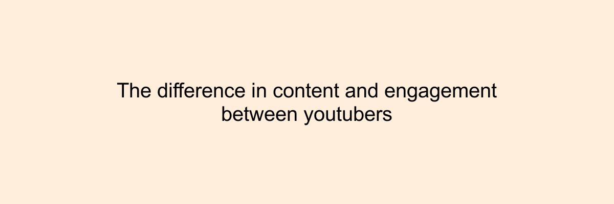

```{r setup, include=FALSE}
knitr::opts_chunk$set(echo=TRUE, message=FALSE, warning=FALSE, error=FALSE)
library(tidyverse)
library(magick)
```

```{css echo=FALSE}
body {
  background-image: linear-gradient(to bottom, #DBECFF, #DCDBFF);
  background-size: 100% 200%;
  transition: background-position 0.5s;
}

body:hover {
  background-position: 0 100%;
}

a {
  color: #88498F;
  
}

a:hover {
  color: #FFEEDB;
}
```

## Introduction

For this project, I decided to use [Donut](https://www.youtube.com/@Donut) and [Joshua Weissman](https://www.youtube.com/@JoshuaWeissman) as my YouTube channels. This is because I like cars, cooking, and I'm subscribed to them. I wanted to create a visualisation comparing the videos to shorts, and I also wanted to create a graph on the number of comments to the length of the video title as I thougt maybe longer titles could be troll titles and would lead to more comments. In the end, I managed to create the second idea. The first idea had an issue where I did not know how to facet_wrap after creating the new table, so I decided to just create a joint "shorts vs videos" graph instead. I chose geom_bar and geom_cols for the plot 1 and 3 as they made sense to me and other geoms looked weird. I chose geom_point for plot 2 as it looked cool with the colours.


## Dynamic data story

With the data I collected from the YouTube API, I created the following dynamic data story:


I believe the custom theme choice of my graphs show creativity. I chose light coloured backgrounds(matching link hover colour) and higher contrasting colours for the graphs themselves. I also removed the grid lines for a cleaner looking graph. The colours of the graph were selected to match the colour of the slides to look better, and to nicely contrast the html report as well.


## Learning reflection

One key idea I learnt from this module was how to create dynamic visualisations. This was basically the gif with the graphs of data I collected from YouTube. This was cool to learn as I can essentially create a mini slideshow of different data visualisations for anything I want. So if I wanted to create a visualisations for the number of job and internship rejections I have and will have, I just have to track it over time and eventually can create a gif of it, which will be cool to look at. It would be interesting to somehow collect data on all the videos as well as future videos automatically so I can then truly compare them against each other.


## Appendix
```{r file='visualisations.R', eval=FALSE, echo=TRUE}

```

```{r file='data_story.R', eval=FALSE, echo=TRUE}

```